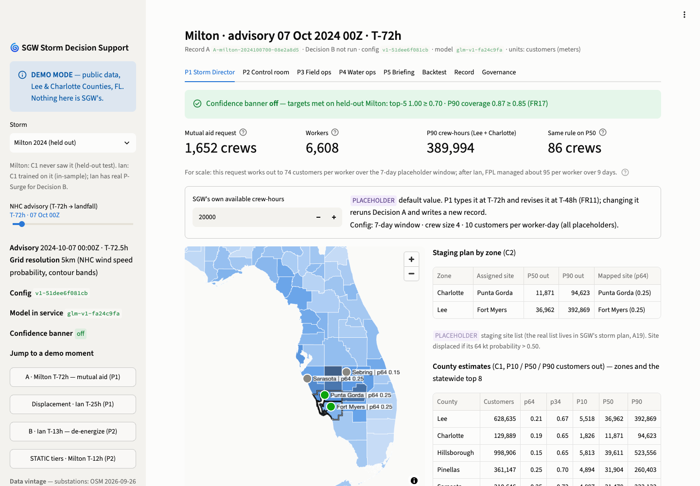
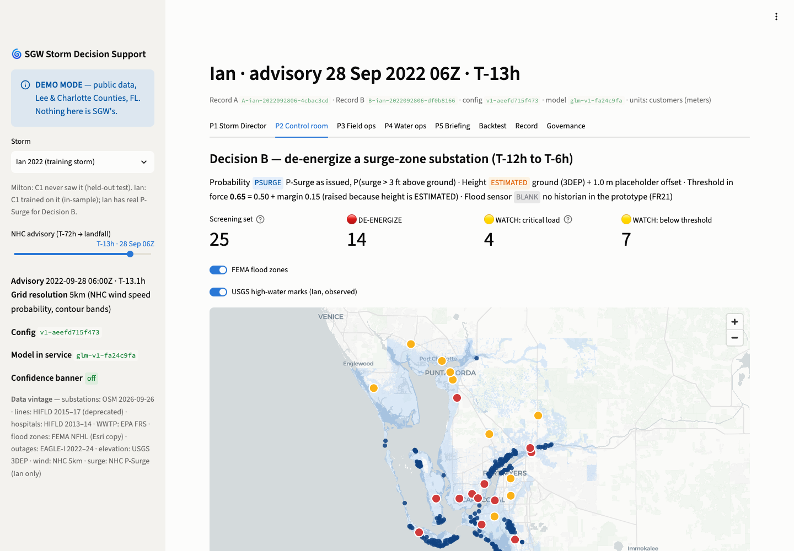

# SGW Storm Decision Support — prototype

A working prototype of the MVP in the SGW PRD (v2.0): the Storm Director's mutual aid and staging decision at
T-72h (**Decision A**) and the control room's substation de-energization decision at T-12h (**Decision B**), run
from the NHC forecast as issued, on public data for Lee and Charlotte Counties, Florida. The platform recommends,
people decide, and every decision and override lands in an append-only record that replays exactly. Hurricane
Milton is replayed as a live storm the model never saw; Ian is replayed with its real P-Surge forecast and
checked against USGS high-water marks. Nothing here is SGW's data.

**Video walkthrough:** _link added after recording_ · **Docs:** [Architecture](docs/ARCHITECTURE.md) ·
[Models](docs/MODELS.md) · [Backtest report](docs/backtest_report.md) · [Data](docs/DATA.md) ·
[Limitations](docs/LIMITATIONS.md)

## Run it (no API key, no data download)

```bash
docker compose up --build        # then open http://localhost:8501
```

or, with Python 3.11 or 3.12:

```bash
make demo                        # creates .venv, installs requirements, opens on http://localhost:8501
```

The app reads the committed `data/processed/` (1.5 MB) and model files. Map tiles come from CARTO over the
internet; everything else runs offline. On macOS without Homebrew's `libomp`, the app runs normally but the
LightGBM fallback model cannot load (`brew install libomp`, or use Docker). Other targets: `make test` (20
tests), `make fit` (refit C1 and regenerate the backtest), `make data` (re-pull every public source, needs
network), `make tabpfn` (optional benchmark, installs torch).

| P1 Storm Director, Milton T-72h | P2 Control room, Ian T-13h |
|---|---|
|  |  |

## The two demo beats

**A. Milton, held out, T-72h (P1).** The sidebar defaults to Milton's 7 Oct 00Z advisory. C1 gives customers out
per county at P10/P50/P90 for all 67 Florida counties; C2 turns Lee and Charlotte's P90 into crew-hours and a
mutual aid request of **1,652 crews** (placeholder crew-hours, crew size and restoration window, all labelled),
and checks each staging site's 64 kt probability. For scale, that request is 74 customers per worker over the
7-day placeholder window; after Ian, FPL managed about 95 per worker over 9 days. P1 approves, edits or overrides with a mandatory reason; the
action is written to the record, the P5 briefing quotes it, and "Rerun this record" returns the identical output
hash. The confidence banner is off: the active model met its targets on Milton (top-5 county match 1.00, P90
coverage 0.87). Withdraw it on the Governance tab and the fallback LightGBM comes into service with the
low-confidence banner on (top-5 0.60, P90 coverage 0.81). Slide Ian to T-25h to see both staging sites displaced
to Sebring by the wind rule.

**B. Ian, T-12h (P2).** Switch the storm to Ian: the 28 Sep 06Z advisory runs Decision B on the 25 substations in
FEMA flood zones with NHC's real P-Surge (P(surge > 3 ft above ground)), an ESTIMATED switchgear height (ground +
1.0 m) and the threshold raised from 0.50 to 0.65 because the height is estimated. **14 DE-ENERGIZE, 11 WATCH**,
4 of them held on WATCH because a hospital or pumping station on the placeholder feed has unknown backup. Toggle
the USGS high-water marks on the map; the FR22 table compares the flags with what Ian did.

## What is real and what is a placeholder

| Real (public, as issued) | Placeholder or estimate (labelled on screen) |
|---|---|
| NHC wind speed probabilities, every 6-h advisory; NHC P-Surge for Ian | Switchgear height: ESTIMATED (3DEP ground + 1.0 m) |
| EAGLE-I county outages (training and truth); USGS high-water marks | Feeding substation: PLACEHOLDER FEED (nearest by distance) |
| FEMA flood zones and BFE; USGS 3DEP elevation | SGW crew-hours, crew size, restoration window, staging sites |
| OSM substations, HIFLD lines and hospitals, EPA wastewater plants | Hospital backup status (unknown, treated as none); flood sensors (BLANK) |
| Model backtest on a storm it never saw | STATIC tier routed to P2's judgment where no P-Surge grid is loaded (Milton) |

Scope, substitutions and every fallback taken are in [LIMITATIONS.md](docs/LIMITATIONS.md). The per-asset
ranking is an **exposure ranking, county-validated** only; C1 is validated on one held-out storm.

## Results in one line each

- **FR16, Milton T-72h, 67 counties:** the GLM was selected on leave-one-storm-out between the two training storms
  (mean Spearman 0.46 vs LightGBM 0.11), and Milton was reported once as a holdout: GLM Spearman 0.90, top-5 match
  1.00, P90 coverage 0.87; LightGBM 0.81 / 0.60 / 0.81; TabPFN v2 benchmark 0.85 / 0.60 / 0.79 (lowest MAE). Built
  with PriorLabs-TabPFN. Between the training storms skill is low (0.09–0.64); two training storms is the main limit.
- **Outside the screening set:** Ian's P-Surge put >= 0.8 probability of > 3 ft on 3 substations in Zone X that the
  FEMA screening set never looks at; the prototype surfaces them (P2 toggle), and the recommendation to SGW is to
  screen on P-Surge coverage as well as FEMA zone.
- **FR22, Ian T-12h:** P-Surge flags catch every observed flood (recall 1.0) but over-flag (precision 0.2 at the
  3 km truth radius); without P-Surge, sites get a STATIC tier and route to P2's judgment. High-water marks are
  sparse, so read each row with its sample size.

## Layout

```
src/pull/       one script per public source (+ manifest.yaml, inventory.py)
src/store/      advisory store, outage targets, asset registry, decision record (SQLite, append-only)
src/models/     C1 features, GLM + LightGBM, backtest, optional TabPFN challenger
src/decisions/  C2 staging, C3 exposure, C4 dependency, C5 inundation, run.py (CLI + replay)
src/llm/        C6: template briefing, retrieval Q&A, provider switch, prompts
app/            Streamlit app (P1-P5, backtest, record, governance)
config/v1.yaml  every configurable value; its hash is the config version on every screen and record
```

**Briefing with an LLM (optional).** Copy `.env.example` to `.env`, set `LLM_PROVIDER` (`anthropic`, `ollama`,
`groq` or `gemini`) and its key, and `pip install -r requirements-llm.txt` for Anthropic. `ollama` is the
self-hosted switch that the PRD names as the production path. The default `template` mode needs nothing.

Code: MIT. Data: US public-domain sources; OpenStreetMap (c) OpenStreetMap contributors, ODbL; EAGLE-I (ORNL)
CC BY 4.0. See [DATA.md](docs/DATA.md).
