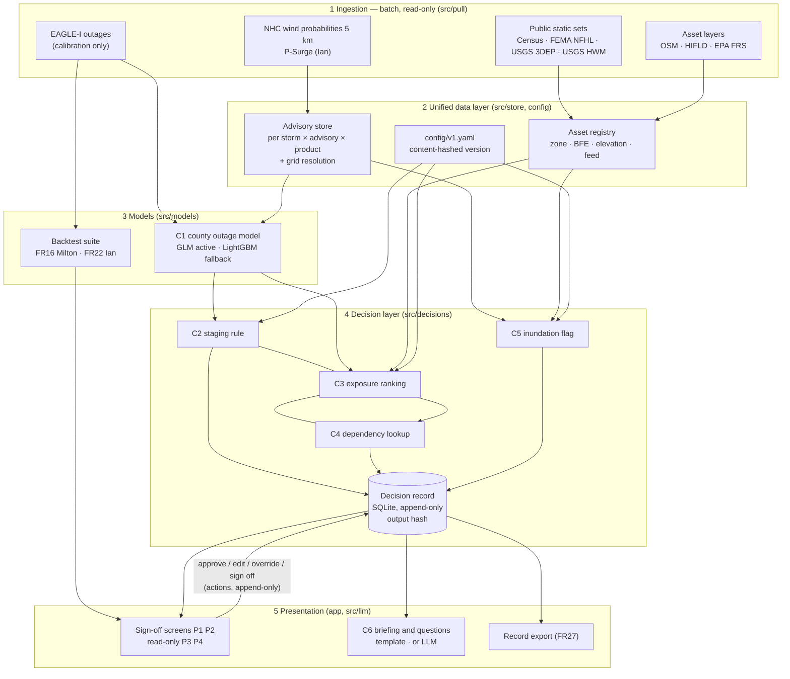

# Architecture

The prototype implements the PRD's five layers (Section 6) at prototype scale. The shape is the production
shape; the sources and the scale are not (see LIMITATIONS.md).

## The record is the centre

Every run writes one record per decision per advisory (FR25): the advisory snapshot files and their grid
resolution, the configuration version, the model version, the inputs, the estimates, the recommendation, the
crew-hours used, and for Decision B the height source, the probability source and the (blank) sensor value.
`output_hash` is a SHA-256 over the canonical JSON of the estimates and the recommendation.

- **Append-only.** SQLite triggers refuse any update to what was decided and any delete (`src/store/record.py`).
  Human actions (approve, edit, override, sign-off, decline, storm operations, model withdrawal) are appended to
  an `actions` table; edits, overrides, declines and withdrawals must carry a reason (FR23).
- **Replayable.** The full YAML of every configuration version a record used is stored beside it. "Rerun this
  record" recomputes the decision from the stored inputs and compares hashes (NFR reproducibility: 0 difference).
  A record whose model version is no longer deployed reports that instead of silently re-scoring.
- **Idempotent.** The record ID is derived from the inputs, config version and model version, so rerunning the
  same advisory does not duplicate it.
- **Everything reads it.** The screens, the briefing and the question interface read records; nothing reads the
  models' intermediate outputs.

## Order of a run (`src/decisions/run.py`)

1. C1 predicts P10/P50/P90 fraction out for all 67 Florida counties from the advisory's county p64/p34.
2. C2 turns the two zones' P50/P90 into crew-hours and whole crews, and checks each staging site's 64 kt
   probability (Decision A).
3. C3 applies C1 per 0.1-degree cell and multiplies by static weights; C4 passes substation scores to dependents.
4. C5 runs when a P-Surge snapshot exists for the advisory, or from T-48h on the STATIC fallback, where each
   site gets a tier from FEMA zone and BFE and routes to P2's judgment (Decision B).
5. Both records are written. Only then can C6 read them.

## Configuration and model governance

- `config/v1.yaml` holds every configurable value (FR28). Its version is `v1-` plus the first 12 hex of its
  SHA-256, shown in the sidebar and stored in every record, so any edit is a new version. The prototype shows
  the storm-operations declaration (FR29) and marks the configuration FROZEN; enforcing the freeze on the file
  is a production control (identity provider + change workflow).
- `models/c1/selection.json` records the active model version chosen by the pre-registered rule (FR30). P1 can
  withdraw it during a storm (with a reason); the system then serves the fallback version and the banner follows
  that version's backtest (FR17). P6 restores it after review. Model versions are content hashes of the files.

## C6 is outside the decision path

C6 has one provider switch (`LLM_PROVIDER`: template, anthropic, ollama, groq, gemini; `src/llm/provider.py`).
It receives only the written record, is instructed to copy numbers verbatim and cite record IDs, and has no write
path: the app writes the only log entry (BRIEFING_SENT, with the draft hash). A deterministic check flags any
number in an LLM draft that is not in the record (FR35). Removing C6 removes the draft and the question box and
nothing else; the fixed template (FR36) is the default. In production the switch points at a self-hosted model
(`ollama` here), so no operational data leaves SGW's environment (A7).

## What the platform never does

No control action and no write to OMS, SCADA or field tools (FR26): the prototype has no such connections at
all. It never requests mutual aid, de-energizes anything or sends a briefing; the screens say who does. The demo
binds to localhost.

## From prototype to production

| Prototype | Production |
|---|---|
| OSM / HIFLD / EPA assets, no entity resolution | Phase 0 registry (GIS + maintenance + field ops), one ID per asset |
| Decision runs when an advisory is selected | Scheduler: every NHC advisory, refresh within 30 minutes (M1) |
| SQLite record in `var/` | Managed database, encrypted with SGW keys, 7-year retention (A15, A21) |
| Roles typed into forms | SSO + MFA, RBAC mapped to identity-provider groups (A20) |
| Template or hosted LLM on public data | Self-hosted model in SGW's environment (A7) |
| Placeholder feeds, heights, crew-hours, sites | Registry feeds, recorded switchgear heights, crew roster, storm-plan sites |
